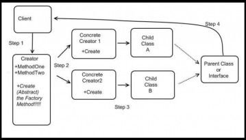

# الگوی طراحی Factory Method (Virtual Constructor)
1. The factory method pattern defines an interface for creating an object, but lets subclasses decide which class to instantiate.
2. Factory Method lets a class deffer instantiation to subclasses.
3. Eliminates need to bind creation code to specific subclasses.
4. May need to subclass Creator for each ConcreteProduct
5. Provides hooks for subclasses.
6. Connects parallel class hierarchies.
7. در الگوی طراحی Factory Method از Simple Factory استفاده می‌کنیم.
8. در Simple Factory تنها یک کارخانه داریم. اما اگر چند کارخانه داشته باشیم که همگی این کارخانه‌ها محصولات مشابهی تولید کنند مثلاً همگی موبایل تولید می‌کنند (اما هر کارخانه پیاده‌سازی خودش را دارد) در چنین حالتی از Factory Method استفاده می‌کنیم. به این صورت یک رابط برای کارخانه‌ها ایجاد می‌کنیم و پیاده‌سازی متود ساخت محصول را به کارخانه‌ها واگذار می‌کنیم. هر یک از کارخانه‌ها از Simple Factory برای تولید محصولاتش استفاده می‌کند.
9. به روش بالا می گوییم: Allowing the subclasses to decide یا Real-time decision
10. برای اینکه پارامترهای Concrete Factory بتوانند `Type-Safe` باشند، می‌توانیم از `enum` استفاده کنیم و یا روش‌های بهتر.
11. وقتی که نمونه‌سازی اشیاء را در یک آبجکت یا متد، کپسوله کنیم، باعث بالا رفتن maintenance می‌شود و باعث می‌شود از کدهای اضافی و مجدد خودداری شود.
12. Dependency Inversion Principle.

## ساختار




## مثال ۱- ساخت موبایل از دو کارخانهٔ متفاوت

#### Product (Mobile)
یک واسط برای تمامی موبایل‌ها تعریف می‌کنیم و ویژگی‌ها و رفتارهای مشترک را ذکر می‌کنیم.

1. نام موبایل
2. رنگ

#### ConcreateProduct
واسط موبایل را برای موبایل‌های مختلف پیاده‌سازی می‌کنیم.

1. Nokia N900
2. Nokia N95
3. Motorola Atrix
4. Motorola A1200

#### Creator/Factory
واسط کارخانه
createMobile()

#### ConcreteCreator/ConcreteFactry
هر کدام از کارخانه‌ها باید واسط کارخانه را پیاده‌سازی کنند.

1. NokiaFactory
2. MotorolaFactory
3. ...

#### Client
```
Factory  factory =  new NokiaFactory()
Car car = factory.createMobile(مشخصات موبایل، نام موبایل، مثل رنگ و ...)
```

## بیشتر بخوانید
1. کلاس SAXParserFactory
2. http://javapapers.com/design-patterns/factory-method-pattern/
3. http://stackoverflow.com/questions/9963090/factory-pattern-vs-factorymethod-pattern
4. http://c2.com/cgi/wiki?FactoryMethodPattern


