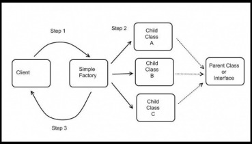

<div dir="rtl">
# Simple Factory (Idiom)
1. Simple Factory returns instances of classes that have the same methods. They may be instances of different derived subclasses, or they may in fact be unrelated classes that just share the same interface. Either way, the methods in these class instances are the same and can be used interchangeably.
2. Simple Factory یک الگوی طراحی واقعی نیست. اما به عنوان یک idiom برنامه‌نویسی بسیار رایج به کار گرفته می‌شود.
3. وصل کردن کد به کلاس‌های کانکرت، کد را شکننده و غیرقابل انعطاف می‌کند.
4. جایگزینی اپراتور new با متدهای createConcrete
5. می‌توانیم از متد استاتیک در این الگو استفاده کنیم.
6. استفاده از new باعث ایجاد نمونه از کلاس‌های کانکرت می‌شود.
7. استفاده از new یک نوع برنامه‌نویسی مرتبط با پیاده‌سازی‌ست تا یک برنامه‌نویسی مرتبط به اینترفیس. (کد شکننده، خطا پذیر، غیر قابل انعطاف می‌شود)
8. کلاس‌های کانکرت معمولاً بیشتر از یک بار یک مکان نمونه‌برداری (Instantiate) می‌شوند.
9. بنابراین در صورتی که بخواهیم تغییر بدهیم باید تمامی نمونه‌برداری‌ها را در مکان‌های مختلف را تغییر دهیم. که این کار طاقت‌فرسا، سخت و خطاپذیر است.

# چرا از Simple Factory استفاده می‌کنیم؟
1. Multiple Clinets neeeding same types of object
2. Ensure consistent object initialization.





# Keywords:
1. Depenency
2. Loose Couple
3. Concrete classes (When you see `new`, think `concrete`)
4. Encapsulating object creation

# مثال
```java
public class PizzaStore {
	SimplePizzaFactory factory;
 
	public PizzaStore(SimplePizzaFactory factory) { 
		this.factory = factory;
	}
 
	public Pizza orderPizza(String type) {
		Pizza pizza;
 
		pizza = factory.createPizza(type);
 
		pizza.prepare();
		pizza.bake();
		pizza.cut();
		pizza.box();

		return pizza;
	}

}
```

```java
public class SimplePizzaFactory {

		// می‌توانیم این متود را استاتیک تعریف کنیم تا نیازی به ساخت شیء فکتوری نباشد و بتوانیم مستقیما از کلاس این متود را صدا بزنیم.
	public Pizza createPizza(String type) { 
		Pizza pizza = null;

		if (type.equals("cheese")) {
			pizza = new CheesePizza();
		} else if (type.equals("pepperoni")) {
			pizza = new PepperoniPizza();
		} else if (type.equals("clam")) {
			pizza = new ClamPizza();
		} else if (type.equals("veggie")) {
			pizza = new VeggiePizza();
		}
		return pizza;
	}
}
```


# اطلاعات بیشتر
1. [Simple Factory Pattern Side by Side with Abstract Pattern](http://www.c-sharpcorner.com/UploadFile/mosessaur/simplefactorypattern03012006124722PM/simplefactorypattern.aspx)
2. [Simple Factory](http://shamsmi.blogspot.fr/2007/08/simple-factory.html)
3. ص ۱۱۹ Head First Design Patterns

